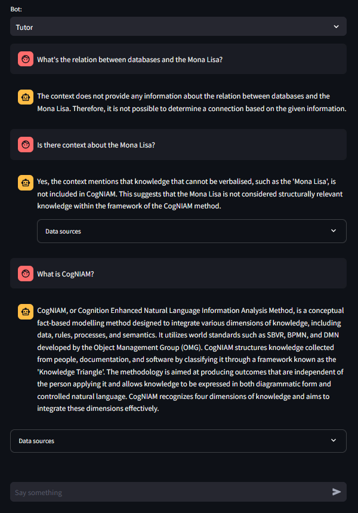

# Basic RAG System

A Retrieval-Augmented Generation (RAG) system using Solr for document retrieval and Ollama/OpenAI for language generation.

## Documentation

- **[QUICKSTART.md](QUICKSTART.md)** - Step-by-step setup guide (recommended for first-time users)
- **[DONE.md](DONE.md)** - Complete debugging log with all fixes applied
- **[Questions.md](Questions.md)** - Technical Q&A about RAG implementation
- **[SOLR_FIXES.md](SOLR_FIXES.md)** - Detailed Solr configuration fixes

### Installation
1. Install [git](https://git-scm.com/downloads) and [docker](https://docs.docker.com/engine/install/)
2. Clone / download this repository and navigate into the root directory:
```bash
git clone https://github.com/Kristof-me/Basic-RAG
cd Basic-RAG
```
3. Set up docker for solr:
    - *Note: Turning off security manager could expose your system to security risks. For production versions please setup authentication and java policies which allow scripts to run.*
```bash
docker pull solr
docker create --name solr_docker -v ./retrieval/volume:/var/solr -p 8983:8983 -e SOLR_SECURITY_MANAGER_ENABLED=false solr
docker start solr_docker
```
4. Reload the core by visiting [http://localhost:8983/solr/admin/cores?action=RELOAD&core=ragcore](http://localhost:8983/solr/admin/cores?action=RELOAD&core=ragcore)
5. Select and setup your model:
    - With Ollama:
        ```bash
        docker pull ollama/ollama
        docker create --name ollama_docker --restart unless-stopped -v  ./LLM/ollama:/root/.ollama -p 11434:11434 -e OLLAMA_KEEP_ALIVE=24h -e OLLAMA_HOST=0.0.0.0 ollama/ollama 
        docker start ollama_docker

        # to setup nvidia support checkout https://hub.docker.com/r/ollama/ollama
        # select a model here: https://ollama.com/library
        docker exec -it ollama_docker ollama run <model_name>
        ```
    - With OpenAI: open `/UI/ui.py` and change line 24-25 to the following
        ```python
        #client = OllamaClient(os.environ.get("OLLAMA_SERVER"), os.environ.get("OLLAMA_MODEL"), solr_handler)
        client = OpenAI_Client(os.environ.get("OPENAI_API_KEY"), os.environ.get("OPENAI_MODEL"), solr_handler)
        ```

6. Configure a `.env` file in the root directory (you can skip the LLM provider you won't use):
```env
SOLR_SERVER=localhost:8983
CORE_NAME=ragcore
OLLAMA_SERVER=localhost:11434
OLLAMA_MODEL=<model_name:details>
UI_PORT=8501
OPENAI_MODEL=<model_name>
OPENAI_API_KEY=<api_key>
```

7. Install packages: (python 3.9+ is required)
```bash
pip install -r requirements.txt
# Or manually:
# pip install python-dotenv ollama beautifulsoup4 pypdf pysolr wikitextparser streamlit langdetect openai
```

### Run
- For the first time (downloads data, filters, uploads to Solr, starts UI):
    ```bash
    python __main__.py --all
    ```
- Later (just starts the UI):
    ```bash
    python __main__.py --ui
    ```
- Individual steps:
    ```bash
    python __main__.py --download  # Download Wikipedia data
    python __main__.py --filter    # Filter and clean data
    python __main__.py --upload    # Upload to Solr
    python __main__.py --ui        # Start web interface
    ```

### Usage
When the UI launches at http://localhost:8501, you can start chatting with the system. Questions will automatically trigger RAG retrieval from the knowledge base.



### Troubleshooting
If you encounter issues during setup, see [DONE.md](DONE.md) for solutions to common problems.